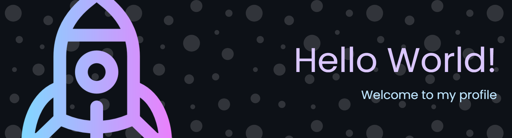
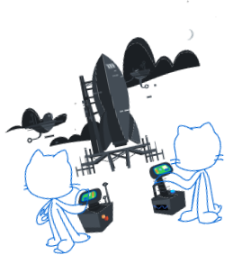
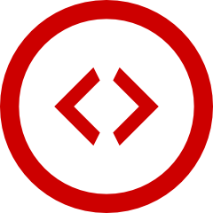
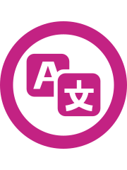

# こんにちは、K4zuki T です



*デジタルコンテンツクリエイター（デベロッパー / プログラマー）*

PHPをメインウェポンに戦う、ソロプレイヤー系エンジニアです。
PHPを書きつつ、理想のデスク環境（ガジェット・自作キーボード）を追求しています。
基本的にダークモードの住人なので、ライトモードの画面を見せられるとダメージを受けます。
大雑把に見えて、意外と細かいことを気にします。

人生にも `Ctrl + Z`（現在の記憶を持ったまま過去へ）と、`Ctrl + Shift + Z`（過去改変の記憶を持ったまま未来へ）の実装を待ち望んでいます。

```
{
  "mode": "ソロ",
  "theme": "ダークモードのみ",
  "languages": ["PHP", "日本語"],
  "hobbies": ["アニメ", "・ゲーム", "YouTube"],
  "likes": [
    "ガジェット (PC 系, スマホ)",
    "自作 PC & キーボード",
    "イヤホン & ヘッドホン"
  ],
  "weakness": "明るい画面",
  "traits": [
    "意外と神経質",
    "人生もゲームもソロプレイヤー"
  ]
}
```

<h2><picture>
  <source media="(prefers-color-scheme: dark)"  srcset="./assets/wordpress-logo-dark.svg" width="auto" height="28" />
  <source media="(prefers-color-scheme: light)" srcset="./assets/wordpress-logo-light.svg" width="auto" height="28" />
  
  </picture> WordPress への貢献</h2>

-  Plugin Developer
-  Core Contributor
-  Translation Contributor
-  Support Contributor
-  WordCamp Organizer
-  WordCamp Speaker

<h2> 新着記事</h2>

<!-- BLOG-POST-LIST:START -->
- [Windows 11 で WSL2 &lpar;Windows Subsystem for Linux&rpar; を設定](https://zenn.dev/k4zuki02h4t4/articles/e042904a472e6b)
- [生成AIでイラスト年賀状を生成してみたので、その手順を公開【ChatGPT・Gemini・Nano Banana Pro】](https://note.com/k4zuki0tsuhata/n/nb7938f8ef0d3)
- [【Laragon】XAMPP・MAMPに代わるWindows向けLAMP環境【軽量＆簡単】](https://zenn.dev/k4zuki02h4t4/articles/92111b5d112653)
- [振り返れば難局ばかりの日々…それでも明日を選ぶ理由（2025年総括）](https://note.com/k4zuki0tsuhata/n/n09f7ea2c58cb)
- [【NTT 東日本光コラボ回収代行分】en ひかりの支払い方法を変更する手順と請求履歴の確認方法](https://note.com/k4zuki0tsuhata/n/n5dcbfb33d93f)
- [Intel NIC X710-TL/T2L の高速化／パフォーマンス調整のプロパティー詳細設定](https://zenn.dev/k4zuki02h4t4/articles/cf4372c152016b)
- [【2025年版】XAMPP・MAMPに代わるWindows向けLAMP環境3選【軽量＆簡単】](https://zenn.dev/k4zuki02h4t4/articles/cb3ca912c9f289)
<!-- BLOG-POST-LIST:END -->

## 💛コンタクト
ネットの海、あるいは街のどこかで見かけたら声をかけてください。👋
